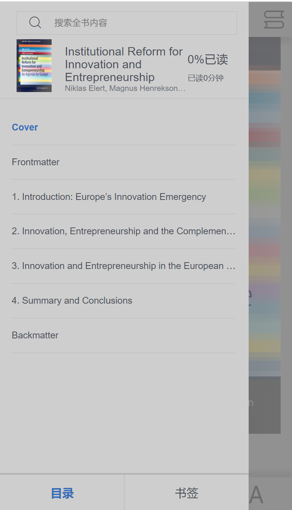
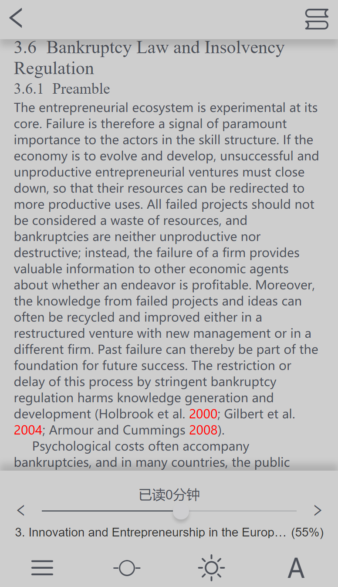
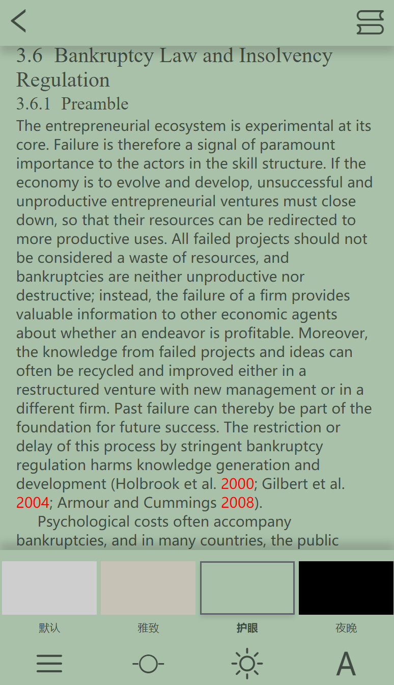
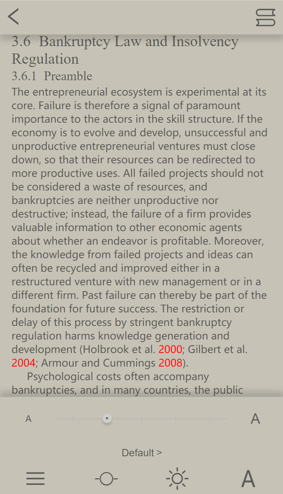
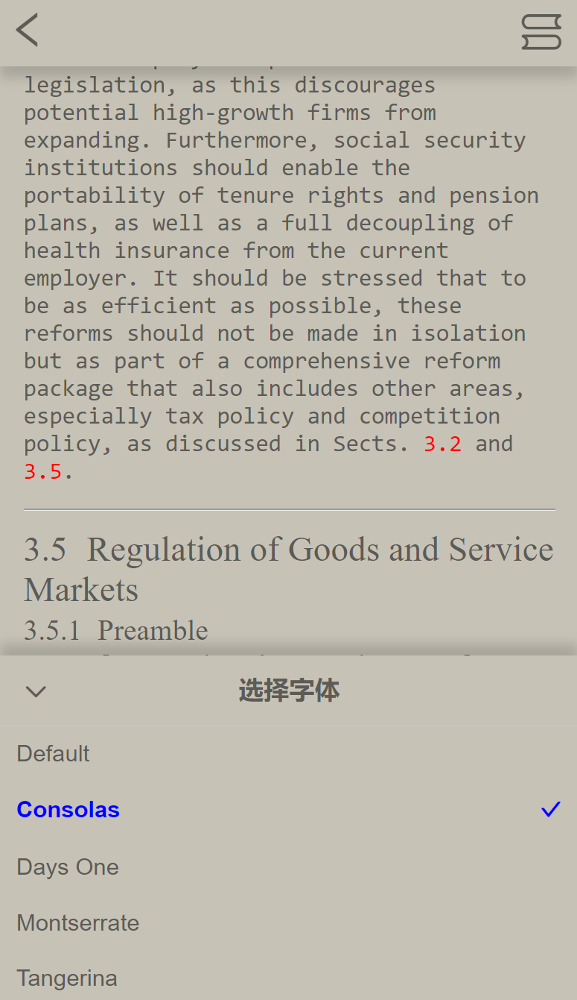
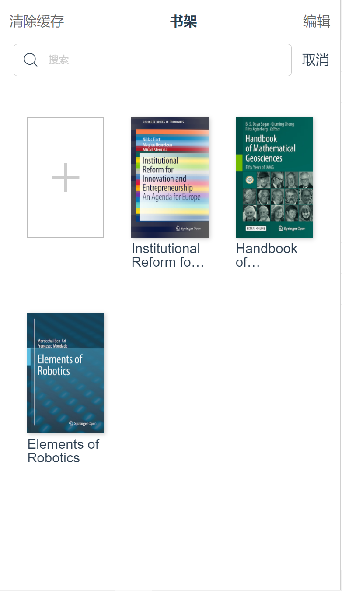
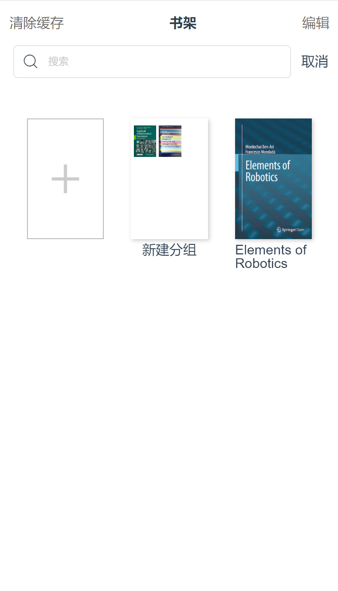

🎈 描述：基于Vue3开发的书城项目

🎈 原作者地址： https://coding.imooc.com/learn/list/285.html

🎈 总结：https://ymlog.cn/2021/01/22/前端 WebBookApp总结/

🎈 Github仓库地址：https://github.com/ArchKS/eBook

🎈 效果演示视频： https://www.bilibili.com/video/BV1Yt4y167c8

**共计46个组件，涉及到的技术有： h5 css3 vue vuex vue-router ePub.js scss node nginx**

---

**截图演示**
<p float="left">

</p>

<p float="left">



<p>


<p float="left">




</p>


<p float="left">



</p>

Usage:

```
yarn
yarn s
```


## 开发日志

2020/12/13


- 准备工作
    - 字体图标
    - 项目依赖包epubjs
    - Web字体
    - Viewport配置
    - rem配置
    - global.scss和reset.scss 
    - 静态资源服务器


第四章

- 阅读器开发 [解析渲染]->[翻页]->[字号+字体]->[主题]->[进度]->[目录]->[搜索]->[书签]->[页眉页脚]->[分页]
- 阅读器解析和渲染
    - 采用Vue-Router动态路由 将链接解析为书名
    - 采用HTTP获取书籍资源
    - 采用Epubjs渲染并展示到页面上
    - [ VueX剥离数据，Minix精简代码，mapGetter简化VueX，Epubjs解析基本用法 ] 

- 阅读器翻页功能的实现
    - 编写Title和Menu组件，添加图标
    - 左滑下一页，右滑上一页，点击显示菜单
    
- 字号和字体设置
	- 创建字号设置组件，创建相关值用于控制字号设置组件的显示和隐藏
	- 在utils下创建book.js对象，将字体大小全部存入对象中
	- settingVisible = 0 显示字号设置面板
	- 编写html的template模板 
		- 字号设置： preview + select(line + point-wrapper>point>small-point + line) + preview
	- (defaultFontSize,set_defaultfontsize)在数据层面更改字体大小，控制字体间隔的切换
	- 将book对象写入vuex，便于在EbookFontSize.vue中修改字号后进行渲染
	- 字体设置功能 set-font-family
		- 定义默认字体
		- 编写布局（字体和图标）
		- 格式化插件瞎几把改代码，把fontSize改成了fontsize，害的bug调了好久
		- EbookFontSettingUp组件无法被加载，组件写到computed里了
		- 点击Default弹出字体选择
		- 字体选择Title和ItemList 的HTML、CSS编写
		- 点击ItemList，选中部分变蓝，电子书默认字体被修改，完成到EPUBrendition.theme渲染字体
		！ 可以选中和更改默认字体，但EPUBJS无法进行渲染

2020/12/23

-  解决字体无法渲染问题
-  创建布局的scss变量
-  封装环境变量.env
-  缓存字体字号设置
-  中英文国际化设置（i18n不支持Vue3 ）
-  主题设置（默认，雅致，护眼，夜晚）， 通过在head后添加link标签的方式设置全局主题


2020/12/27

- 进度条功能[获取用户阅读时间、定位当前阅读进度、获取用户阅读章节并显示章节名、点击左右两侧图标可以快速切换到上一章或者下一章]
- 拖动进度条改变渲染页面


2020/12/29
  	- 上一章、下一章 功能实现 ， 上下章切换的时候可以改变进度条进度 
  	- 保存阅读进度 => 用户翻页、拖动进度条、切换章节后，都需要保存阅读进度
  	- 解决加载进度条progress为null的问题 => 分页未完成，需要在分页完成后刷新位置
  	- 完成阅读时间
  	- 问题： 切换章节后，再次加载章节不保存 （解决：通过在vuex中，设置section后将section写入localStorage，读取vuex 的section时，优先从localStorage中读取）

> 进度条完成内容
拖动进度条改变渲染内容，点击左右箭头切换上下章节，显示当前阅读的章节，显示当前阅读的时间。

> 细节
上下切换章节后，进度条位置和章节显示内容需要跟着改变；
拖动进度条后，章节需要跟着切换；
用户翻页时，进度条和章节需要跟着改变；
当前阅读进度、当前章节进度、当前阅读时间都需要保存到localStorage中，避免下次阅读的时候进度不丢失。


2020/12/30
	- 目录 
	- 点击菜单栏呼出目录，切换主题后，目录样式也会随之变化，初次加载时会展示一个加载动画，目录上方是全文搜索框，中间是图书的基本信息，右侧包含了阅读进度和已读时间，下方是目录信息，二级目录会自动缩进，当前所在位置对应的目录会高亮显示，目录下方右书签目录切换功能
	- 包含Tab的蒙版组件，目录组件，书签组件，加载动画组件
	- 完成点击菜单呼出目录
	- 完成目录基本布局
	- 完成搜索框布局
	- 完成动态组件目录和书签的切换
	- v-show初次渲染所有，但metadata还未获取，改为v-if
	- 完成书籍元信息的展示，包括书籍封面，标题、作者、进度、时间
	- 实现滚动条组件
	- 实现获取滚动条高度，并目录渲染
	- 问题： 目录切换后，section不改变
	- 问题： 章节名称和进度信息中不一致，因为epub book.navigation 只提供1级目录名


控制字体显示行数和省略号

```css
display: -webkit-box;
-webkit-box-orient: vertical;
-webkit-line-clamp: 3;
white-space: normal;
overflow: hidden;
text-overflow: ellipsis;
word-break:  keep-all;
```


2020/12/31

- 编写搜索功能，实现全文搜索
- 没有用其原来的动画，那个动画太难了，写了个简易版的动画
- 重写手势操作，让它能支持书签下拉，放弃initGuest的写法
- 蒙版支持点击和滑动事件
- 拖拽下拉阅读组件


2020/1/1
- 完成书签下拉效果
- 完成书签的添加和删除，但刷新后会丢失数据，没有写入到localStorage
- [BUG] 删除书签，如果添加书签后往后滑动几页，再回到当前页面时删除书签会失效
- 实现书签组件内容
- 设置ebook上下自适应，用来呈现页眉页脚
- 添加组件EbookHeader用来显示页眉
- 添加组件EbookFooter显示页脚
- 下拉书签的鼠标适配
- 点击鼠标事件优化
- 阅读器分页算法 这里不再实现，用百分比代替


> 阅读器开发完成 总结： 首先我们建立了阅读器的框架页面index.vue，通过动态路由， 动态的向EbookReader中传入电子书的路径，在EbookReader中，我们实现了Ebook的解析和渲染，通过VueCli3.0的环境变量，我们可以很方便的引入环境变量，通过手势操作，实现了电子书的翻页。 之后，我们开发了阅读器的标题和菜单组件，用mixin对公共方法进行抽离，用localStorage缓存阅读器的配置，采用i18n实现国际化语言，之后实现了主题设置，主题设置分为两部分，电子书的主题(theme.register和select切换主题)和App的界面主题，这个是通过动态切换CSS实现的，之后是阅读进度，这里我们采用HTML5的Range控件实现滑动条，通过Epubjs的locations.cfiFromPercentage实现阅读器定位，以及下一章、获取当前阅读时间等统计功能。

> 紧接着我们实现了阅读器的目录，在目录中，我们掌握了如何解析阅读器的内容，获取阅读器的图片、标题、作者等信息，之后我们获取的目录的内容，我们封装了一个flatten方法，将树状结果扁平化，在目录中我们实现了搜索功能，搜索文字高亮显示，跳转到搜索位置以及全文中搜索关键字高亮展示

> 在目录功能失陷后，我们加入了书签功能，书签主要是通过touchMove和touchEnd实现了复杂的手势交互，通过改变top值实现了界面的下拉效果，通过动态加载transition实现了界面的回弹动画，通过css绘制了一个书签，设置了不同的状态表示手势操作的不同阶段，这里比较重点的是如何获取当前所在页的文本内容。


2020/1/2 第七章 书城首页、搜索页、列表详情页开发
- [*标题+搜索] -> [随机推荐] -> [猜你喜欢] -> [热门推荐] -> [精选] -> [分类推荐] -> [全部分类] -> [分类列表] -> 详情页
- 完成书城和书城首页的路由搭建
- 完成标题和搜索的布局 标题左侧是返回图标、中间是书城、右侧是推荐按钮

> 向下滑动屏幕时的交互细节：
1、标题和推荐图标的向下渐隐
2、搜索框向下移动到标题位置
3、搜索框逐渐变窄以适应屏幕
4、返回按钮向下居中
5、标题下方显示阴影
	- 实现滚动条组件，便于home复用
	- 实现下拉搜索框和标题的交互效果
> 热门搜索的交互要素
1、点击搜索框，热门搜索渐隐显示
2、点击返回，热门搜索渐隐消失
3、热门搜索滑动页面的时候会出现阴影，回到顶部阴影消失
4、进入热门搜索页面时，滑动位置会清除，返回时首页位置不会清除

- 实现热门搜索组件 hotSearch.vue hotSearchList.vue 是作者提供的，searchBar.vue 是自己写的

> 推荐动画
1、 卡片翻转动画
2、登场动画
3、烟花动画
4、推荐动画

- 没有用作者的卡片翻转动画，用的是简单的动画

2020/1/3
- 完成推荐图书
- 安装mockjs axios， 创建APi目录，用来做网络请求
- 编写mock目录和indexjs初始化 引入mock
- 编写api目录，在indexjs统一写请求地址
- 
- [ 首页title ] [ 猜你喜欢 ] [ 热门推荐 ] [ 精选 ] [ 社会科学 ] [ 经济学... ] [ 分类 ] 
- 完成title-view标题栏
- 完成猜你喜欢


2020/1/5
- 完成热门推荐
- 完成分类图书


2020/1/6

 	- 完成精选
 	- 完成分类集合


 2020/1/11
 	- 完成图书详情页
 	- BUG： 社会科学/.../细分科目没有categoryText，不能实现跳转到详情页
 	- BUG： 详情页点击阅读，加载电子书阅读器时，会导致无法渲染，刷新后即可渲染 [ 猜测时Mockjs的问题 ]


2020/1/13
- [ 书架列表 ]
- 配置store/storeHome的返回，使之能够返回到书架页面
- 创建书架的标题组件 包括'清除缓存' '书架' '选择书籍' '编辑'
- 点击编辑按钮，文本显示为取消


2020/1/14
	- 完成书架搜索框组件
	- 定义动态组件，用来显示三种不同类型的item - 图书item/分类item/添加item
		- 遇到问题： Vue received a Component which was made a reactive object. This can lead to unnecessary performance overhead, and should be avoided by marking the component with `markRaw` or using `shallowRef` instead of `ref` ； 改造响应式组件
	- 完成item关于booklist的分类

2020/1/15
- 完成shelfItemBook.vue的布局
- 完成item的三种样式
- 书架书籍的添加功能：
	- mixin中写添加的公共方法，将书本的信息添加入vuex和Storage
- 完成书籍的添加功能
- 完成书架页面到Home页面以及电子阅读器页面的跳转
- 实现普通书籍的添加、删除、跳转
- 实现Edit编辑按钮选中图书的效果


[书架的Footer - 私密阅读、开启离线、移动到...、移出书架]
[实现 拖拽 添加分类]

2020/1/17
- 完成开发书架的离线缓存步骤
	- 下载电子书为blob格式
	- 将电子书存储到indexDB中
	- 从indexDB中获取电子书并渲染 // 由于mockjs存在，书籍并未渲染成功，留到线上发布的时候解决
- 安装localforage
- 事件完成后的打勾动画

- 书架分类页面开发[|]
	- H5 拖拽事件 / 移动端不支持 drag
	- 在source端： 
		- 拖拽时，记录拖拽的书籍在shelfList中的下标dragSourceIndex，设置drag字段为true
	- 在target端
		- 接收dragSourceIndex和找到target对应的Item / dragTargetIndex
			- 如果item是个category，则在category的itemList中添加shelfList中的书籍，并将shelfList中的书籍删除
			- 如果item是个book，则创建一个新的category，命名为"新建分组"，将这两本书都加入到新建分组，并在shelfList中删除

	- Error; 拖拽分组后，分组itemList为空 	-—————— shelfItem.vue ： 111~122行

```js
// 创建新的category
let newCategory = {
	title: "新建分组",
	itemList: [sourceBook,targetBook],
	id: targetBook.id,
	selected: false,
	type: 2,
};

this.shelfList[this.dragTargetIndex] = newCategory;
this.removeFromBookShelf(sourceBook.bookId);
console.log(this.shelfList); 此时 this.shelfList[this.dragTargetIndex].itemList为空 
```


  	 - 没找到VueX数据消失的解决办法，但全部存入到localStorage中了

2020/1/18
- 编写分类组件，进入分类内部
- 修改分组名： 
	- title设置为div和input，点击div则将div改为input，点击input外面的背景，则将input改为div并且将titile写入到vuex和localStorage
- 完成分组名修改
- 完成分组到书架的拖拽事件
- 完成toast弹出组件
- 修改环境变量, .env.production & .env.development

- 解决BUG： addCss无法渲染
- 解决BUG： 书架布局空隙太大 / align-content: flex-start;
- 解决BUG： 分类详情页间隔太小
- 解决BUG： ebook目录scroll滚动导致 添加书签 行为，其原因是scroll2中修改了offsetY的值
- 解决BUG： 解决MockJS导致的EPUB无法渲染问题，采用线上接口
- 解决BUG： Cannot read property 'cache' of undefined
- 解决BUG： 处理CategoryTItle无法居中的问题
- 解决BUG： 通过nginx处理前端跨域问题


2020/1/19

- 线上发布，测试调试
- 切换路由模式为createWebHistory
- 精简SCSS代码
- 解决BUG：书城首页标题和搜索框动画显示BUG


​	

 2020/1/20
- Fix BUG: 阅读器组件 底部菜单栏 进度条布局错乱
- Fix BUG: 阅读器组件 底部菜单栏 字号设置布局错乱
- 写总结